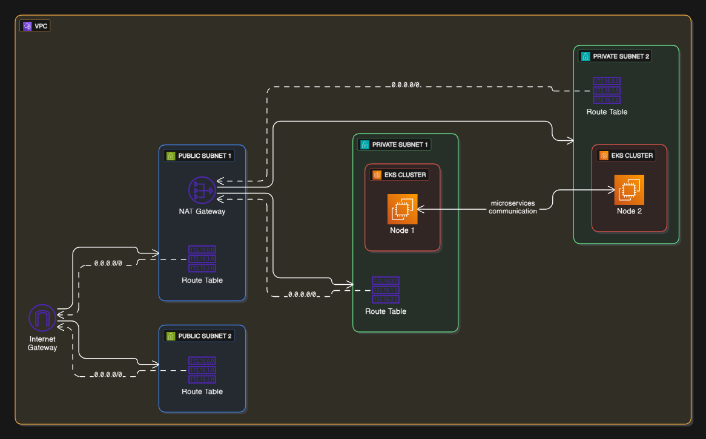

# DevOps End-to-End Implementation: OpenTelemetry Demo on EKS

This project demonstrates an **end-to-end DevOps pipeline** for deploying the [OpenTelemetry Demo](https://opentelemetry.io/docs/demo/) application. It leverages modern DevOps practices including **Infrastructure as Code (IaC)** with Terraform, **Kubernetes (EKS)** for orchestration, **CI/CD pipelines** with GitHub Actions, and **GitOps** with ArgoCD.

---

## 🚀 Project Overview

* **Application**: OpenTelemetry Demo (microservices-based)
* **Orchestration**: Amazon EKS
* **Infrastructure**: Terraform (IaC)
* **CI/CD Pipeline**: GitHub Actions
* **GitOps Deployment**: ArgoCD
* **Monitoring/Tracing**: OpenTelemetry

This project simulates a real-world DevOps workflow for cloud-native microservices.

---

## 🏗️ Step-by-Step Implementation

### 1. Dockerize all the microservices
* Created Dockerfiles for each microservice in the OpenTelemetry demo.
* Built and tested Docker images locally.
* Pushed images to Amazon ECR.

### 2. **Infrastructure Setup with Terraform**



* Provisioned an **Amazon EKS Cluster** with Terraform.
* Created supporting resources:

  * VPC, Subnets, Security Groups
  * EKS Node Groups (managed nodes)
  * IAM roles & policies
* Configured Terraform remote backend for state management (S3 + DynamoDB).
* Used Terraform modules for reusable components.
* Applied best practices for security and scalability.

### 3. **Cluster Bootstrap**

* Configured `kubectl` context to interact with the EKS cluster.
* Installed essential add-ons:

  * **Metrics Server**
  * **Ingress Controller (AWS ALB Controller)**

### 4. **Custom domain configuration with Route 53 and ACM**

* Set up a custom domain using **Amazon Route 53**.
* Configured **AWS Certificate Manager (ACM)** for SSL/TLS certificates.
* Updated Ingress resources to use the custom domain and certificates.


<!-- ### 4. **CI/CD with GitHub Actions**

* Implemented GitHub Actions workflows:

  * **Build & Test Pipeline**

    * Linting, testing, Docker image build
    * Push images to Amazon ECR
  * **Terraform Pipeline**

    * Infrastructure plan & apply
    * Auto-approval with GitHub Environments
  * **ArgoCD Sync Trigger**

    * Update GitOps repo with new manifests -->

<!-- ### 5. **GitOps with ArgoCD**

* Deployed **ArgoCD** to EKS.
* Configured ArgoCD to track the **GitOps repo** (Kubernetes manifests/Helm charts).
* Application manifests stored in a dedicated GitOps repo:

  * Namespace definitions
  * Deployment, Service, Ingress resources
  * ConfigMaps & Secrets
* Any change merged into `main` branch is automatically synced and deployed.

### 6. **Application Deployment (OpenTelemetry Demo)**

* Forked the official OpenTelemetry demo manifests.
* Customized Helm charts/manifests for EKS deployment.
* ArgoCD continuously deploys the demo app to the cluster.
* Verified service discovery, inter-service communication, and ingress routing.

### 7. **Monitoring & Observability**

* OpenTelemetry collector configured for tracing and metrics.
* Exported telemetry data to a backend (e.g., Jaeger/Prometheus/Grafana).
* Verified distributed tracing across microservices. -->

---

## 📂 Repository Structure

```bash
├── infra/                 # Terraform IaC code for EKS setup
├── .github/workflows/     # GitHub Actions pipelines
├── manifests/             # Kubernetes YAMLs / Helm charts (GitOps repo)
├── argocd/                # ArgoCD app configs
└── README.md              # Project documentation
```

---

<!-- ## 🔄 Workflow Summary

1. Developer pushes code → GitHub Actions builds & pushes Docker images → Updates manifests.
2. Terraform workflow provisions/updates infrastructure.
3. GitOps repo updated → ArgoCD auto-syncs with EKS cluster.
4. OpenTelemetry Demo app deployed with monitoring enabled. -->

---

## ✅ Key Learnings & Benefits

* Infrastructure as Code (Terraform) ensures reproducibility.
* Difference between LoadBalancer service type and Ingress in Kubernetes. And why to use Ingress.
<!-- * GitHub Actions automates build, test, infra provisioning, and deployment.
* GitOps with ArgoCD provides declarative, version-controlled deployments.
* Observability integrated via OpenTelemetry.
* Production-grade DevOps workflow for microservices. -->

---

<!-- ## 🔮 Future Enhancements

* Implement service mesh with Istio/Linkerd for advanced traffic management.
* Add security scanning (Snyk/Trivy) to CI pipeline.
* Integrate cost monitoring for EKS workloads.
* Extend observability with Grafana dashboards. -->

---

<!-- ## 📌 Prerequisites to Reproduce

* AWS account with IAM permissions
* Terraform installed (`>=1.5`)
* kubectl & helm installed
* GitHub Actions configured with AWS credentials
* ArgoCD CLI (optional) -->

---

## 📖 References

* [OpenTelemetry Demo](https://opentelemetry.io/docs/demo/)
* [Terraform AWS EKS Module](https://registry.terraform.io/modules/terraform-aws-modules/eks/aws/latest)
* [ArgoCD Documentation](https://argo-cd.readthedocs.io/)
* [GitHub Actions](https://docs.github.com/en/actions)
